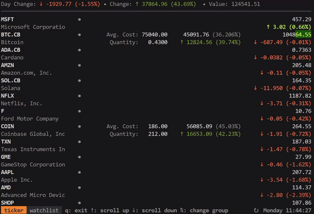
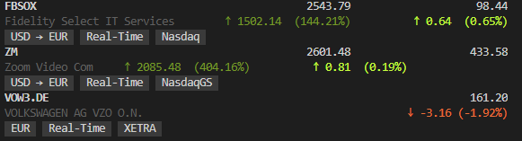

<p>
    <a href="https://github.com/achannarasappa/ticker/releases"></a>
    <a href="https://github.com/achannarasappa/ticker/actions"></a>
    <a href='https://coveralls.io/github/achannarasappa/ticker?branch=master'></a>
    <a href='https://goreportcard.com/badge/github.com/achannarasappa/ticker'></a>
</p>

<h1 align="center">Ticker</h2>
<p align="center">
Terminal stock watcher and stock position tracker
</p>
<p align="center">

</p>

## Features

* Live stock price quotes
* Track value of your stock positions
* Support for multiple cost basis lots
* Support for pre and post market price quotes

## Install

Download the pre-compiled binaries from the [releases page](https://github.com/achannarasappa/ticker/releases) and copy to a location in `PATH` or see quick installs below

**homebrew**
```
brew install achannarasappa/tap/ticker
```

**linux**
```sh
curl -Ls https://api.github.com/repos/achannarasappa/ticker/releases/latest \
| grep -wo "https.*linux-amd64*.tar.gz" \
| wget -qi - \
&& tar -xvf ticker*.tar.gz ticker \
&& chmod +x ./ticker \
&& sudo mv ticker /usr/local/bin/
```

**docker**
```sh
docker run -it --rm achannarasappa/ticker
```

Note: config file can be mounted from the host machine by using a bind mount with `-v ~/.ticker.yaml:/.ticker.yaml`

**snap**
```sh
sudo snap install ticker
```

Note: config file will need to be set with `--config $HOME/ticker.yaml` since Snap does not allow access to dotfiles

### Third-party repositories
These repositories are maintained by a third-party and may not have the latest versions available

**MacPorts**
```
sudo port selfupdate
sudo port install ticker
```

## Quick Start

```sh
ticker -w NET,AAPL,TSLA
```

## Usage
|Option Name|Alias|Flag|Default|Description|
|-------------------|--|-------------------|----------------|-------------------------------------------------|
|                   |  |--config           |`~/.ticker.yaml`|config file location with watchlist and positions|
|`interval`         |-i|--interval         |`5`             |Refresh interval in seconds|
|`watchlist`        |-w|--watchlist        |                |comma separated list of symbols to watch|
|`show-tags`        |  |--show-tags        |                |display currency, exchange name, and quote delay for each quote |
|`show-fundamentals`|  |--show-fundamentals|                |display open price, previous close, and day range |
|`show-separator`   |  |--show-separator   |                |layout with separators between each quote|
|`show-summary`     |  |--show-summary     |                |show total day change, total value, and total value change|
|`show-holdings`    |  |--show-holdings    |                |show holdings including weight, average cost, and quantity|
|`sort`             |  |--sort             |                |sort quotes on the UI - options are change percent (default), `alpha`, `value`, and `user`|
|`proxy`            |  |--proxy            |                |proxy URL for requests (default is none)|
|`version`          |  |--version          |                |print the current version number|

## Configuration

Configuration is not required to watch stock price but is helpful when always watching the same stocks. Configuration can also be used to set cost basis lots which will in turn be used to show total gain or loss on any position.

```yaml
# ~/.ticker.yaml
show-summary: true
show-tags: true
show-fundamentals: true
show-separator: true
show-holdings: true
interval: 5
currency: USD
currency-summary-only: false
watchlist:
  - NET
  - TEAM
  - ESTC
  - BTC-USD
  - SOL.X # Solana price via CoinGecko
  - SAMOYEDCOIN.CG # Samoyed price via CoinGecko
lots:
  - symbol: "ABNB"
    quantity: 35.0
    unit_cost: 146.00
  - symbol: "ARKW"
    quantity: 20.0
    unit_cost: 152.25
  - symbol: "ARKW"
    quantity: 20.0
    unit_cost: 145.35
    fixed_cost: 7.00 # e.g. brokerage commission fee
groups:
  - name: crypto
    watchlist:
      - SHIB-USD
      - VGX-USD
    holdings:
      - symbol: SOL1-USD
        quantity: 17
        unit_cost: 159.10
```

* Symbols not on the watchlist that exists in `lots` will automatically be watched
* To add multiple (`quantity`, `unit_cost`) to the same `symbol`, write two `symbol` entries - see `ARKW` example above
* All properties in `.ticker.yaml` are optional
* `.ticker.yaml` can be set in user home directory, the current directory, or [XDG config home](https://specifications.freedesktop.org/basedir-spec/basedir-spec-latest.html)

### Display Options

With  `--show-summary`, `--show-tags`, `--show-fundamentals`, `--show-holdings`, and `--show-separator` options set, the layout and information displayed expands:


### Sorting

It's possible to set a custom sort order with the `--sort` flag or `sort:` config option with these options:

* Default - change percent with closed markets at the end
* `alpha` to sort alphabetically by symbol
* `value` to sort by position value
* `user` to sort by the order defined in configuration with positions on top then lots

### Groups

Watchlists and holdings can be grouped in `.ticker.yml` under the `groups` property. While running `ticker`, press <kbd>TAB</kbd> to cycle forward through groups.

* If top level `watchlist` or `lots` properties are defined in the configuration file, the entries there will be added to a group named `default` which will always be shown first
* Ordering is defined by order in the configuration file
* The `holdings` property replaces `lots` under `groups` but serves the same purpose

### Data Sources & Symbols

`ticker` pulls price quotes from Yahoo Finance by default but also supports pulling quotes from CoinGecko which supports price quotes for most cryptocurrencies. In order to pull from a specific data source, use a source suffix:

* *none* - symbols with no suffix will default to Yahoo Finance as the data source
* `.X` - symbols with this suffix are shorthand symbols that are specific to ticker and intended to provide more concise and familiar symbols for popular assets (e.g. using `SOL.X` rather than `SOLANA.CG`)
  * The full list of ticker symbols can be found [here](https://github.com/achannarasappa/ticker-static/blob/master/symbols.csv). Initial values are populated with the top 250 cryptocurrencies from CoinGecko at time of release
* `.CG` - symbols with this suffix will use CoinGecko as the data source. The proper coin name can be found on the CoinGecko page in the *API id* field (e.g. for `SOL` go to the coin's [page on CoinGecko](https://www.coingecko.com/en/coins/solana), find the value is `solana`, and use the symbol `SOLANA.CG` in ticker)

### Currency Conversion

`ticker` supports converting from the exchange's currency to a local currency. This can be set by setting the `currency` property in `.ticker.yaml` to a [ISO 4217 3-digit currency code](https://docs.1010data.com/1010dataReferenceManual/DataTypesAndFormats/currencyUnitCodes.html).



* When a `currency` is defined, all values are converted including summary, quote, and position
* Add cost basis lots in the currency of the exchange - these will be converted automatically when `currency` is defined
* If a `currency` is not set (default behavior) and the `show-summary` option is enabled, the summary will be calculated in USD regardless of the exchange currency to avoid mixing currencies
* Currencies are retrieved only once at start time - currency exchange rates do fluctuate over time and thus converted values may vary depending on when ticker is started
* If the `currency-summary-only` is set to `true` and a value is set for `currency`, only the summary values will be converted
* If `currency-disable-unit-cost-conversion` flag to `true`, currency conversion will not be done when calculating the cost basis. This can be useful for users that purchase a foreign security and want to use the currency exchange rate at the time of purchase by inputting the unit cost in their local currency (set in `currency`) rather than using the most recent currency exchange rate.

### Custom Color Schemes

`ticker` supports setting custom color schemes from the config file. Colors are represented by a [hex triplet](https://en.wikipedia.org/wiki/Web_colors#Hex_triplet). Below is an annotated example config block from `.ticker.yaml` where custom colors are set:

```yaml
# ~/.ticker.yaml
watchlist:
  - NET
  - TEAM
  - ESTC
  - BTC-USD
colors:
  text: "#005fff"
  text-light: "#0087ff"
  text-label: "#00d7ff"
  text-line: "#00ffff"
  text-tag: "#005fff"
  background-tag: "#0087ff"
```

* Terminals supporting TrueColor will be able to represent the full color space and in other cases colors will be down sampled
* Any omitted or invalid colors will revert to default color scheme values

### Printing Holdings

`ticker` supports printing holdings to the terminal as text by using `ticker print`. Output defaults to JSON but CSV output can also be generated by passing the `--format=csv` flag.

```sh
$ ticker --config=./.ticker.yaml print
[{"name":"Airbnb, Inc.","symbol":"ABNB","price":164.71,"value":16965.13,"cost":15038,"quantity":103,"weight":53.66651978212161},{"name":"Tesla, Inc.","symbol":"TSLA","price":732.35,"value":14647,"cost":15660,"quantity":20,"weight":46.33348021787839}]
```

* Ensure there is at least one lot in the configuration file in order to generate output
* A specific config file can be specified with the `--config` flag

## Notes

* **Real-time quotes** - Quotes are pulled from Yahoo finance which may provide delayed stock quotes depending on the exchange. The major US exchanges (NYSE, NASDAQ) have real-time quotes however other exchanges may not. Consult the [help article](https://help.yahoo.com/kb/SLN2310.html) on exchange delays to determine which exchanges you can expect delays for or use the `--show-tags` flag to include timeliness of data alongside quotes in `ticker`.
* **Non-US Symbols, Forex, ETFs** - The names for there may differ from their common name/symbols. Try searching the native name in [Yahoo finance](https://finance.yahoo.com/) to determine the symbol to use in `ticker`
* **Terminal fonts** - Font with support for the [`HORIZONTAL LINE SEPARATOR` unicode character](https://www.fileformat.info/info/unicode/char/23af/fontsupport.htm) is required to properly render separators (`--show-separator` option)

## Integrations

* [alpaca-ticker-config](https://www.npmjs.com/package/alpaca-ticker-config) - Pull [alpaca.markets](https://alpaca.markets) positions into `.ticker.yaml` from the command line

## Development

Running tests:
```sh
ginkgo -cover ./...
```

Linting:
```sh
golangci-lint run
```

## Libraries `ticker` uses

* [bubbletea](https://github.com/charmbracelet/bubbletea) - terminal UI framework
* [termenv](https://github.com/muesli/termenv) - color and styling for the terminal
* [term-grid](https://github.com/achannarasappa/term-grid) - grid layout library terminal UIs

## Related Tools

* [tickrs](https://github.com/tarkah/tickrs) - real-time terminal stock ticker with support for graphing, options, and other analysis information
* [cointop](https://github.com/miguelmota/cointop) - terminal UI tracking cryptocurrencies
