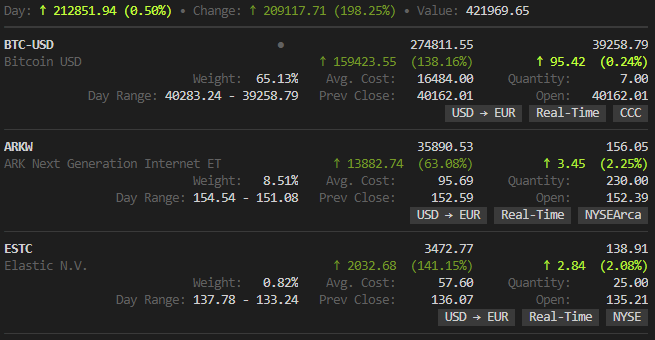

<p>
    <a href="https://github.com/achannarasappa/ticker/releases"></a>
    <a href="https://github.com/achannarasappa/ticker/actions"></a>
</p>


<h1 align="center">Ticker</h2>
<p align="center">
Terminal stock watcher and stock position tracker
</p>
<p align="center">

</p>

## Features

* Live stock price quotes
* Track value of your stock positions
* Support for multiple cost basis lots
* Support for pre and post market price quotes

## Install

Download the pre-compiled binaries from the [releases page](https://github.com/achannarasappa/ticker/releases) and copy to a location in `PATH` or see quick installs below

**mac**
```
brew install achannarasappa/tap/ticker
```

**linux**
```sh
curl -Ls https://api.github.com/repos/achannarasappa/ticker/releases/latest \
| grep -wo "https.*linux-amd64*.tar.gz" \
| wget -qi - \
&& tar -xf ticker*.tar.gz \
&& chmod +x ./ticker \
&& sudo mv ticker /usr/local/bin/
```

## Quick Start

```sh
ticker -w NET,AAPL,TSLA
```

## Usage
|Alias|Flag|Default|Description|
|-|-|-|-|
|  |--config|`~/.ticker.yaml`|config with watchlist and positions|
|-i|--interval|`5`|Refresh interval in seconds|
|-w|--watchlist||comma separated list of symbols to watch|
|  |--show-tags||display currency, exchange name, and quote delay for each quote |
|  |--show-fundamentals||display open price, previous close, and day range |
|  |--show-separator||layout with separators between each quote|

## Configuration

Configuration is not required to watch stock price but is helpful when always watching the same stocks. Configuration can also be used to set cost basis lots which will in turn be used to show daily gain or loss on any position.

```yaml
# ~/.ticker.yaml
show-tags: true
show-fundamentals: true
show-separator: true
interval: 10
watchlist:
  - NET
  - TEAM
  - ESTC
  - BTC-USD
lots:
  - symbol: "ABNB"
    quantity: 35.0
    unit_cost: 146.00
  - symbol: "ARKW"
    quantity: 20.0
    unit_cost: 152.25
  - symbol: "ARKW"
    quantity: 20.0
    unit_cost: 145.35
```

* Symbols not on the watchlist that exists in `lots` will automatically be watched
* All properties in `.ticker.yaml` are optional

### Display Options

With `--show-tags`, `--show-fundamentals`, and `--show-separator` options set, the layout and information displayed expands:



## Notes

* **Real-time quotes** - Quotes are pulled from Yahoo finance which may provide delayed stock quotes depending on the exchange. The major US exchanges (NYSE, NASDAQ) have real-time quotes however other exchanges may not. Consult the [help article](https://help.yahoo.com/kb/SLN2310.html) on exchange delays to determine which exchanges you can expect delays for or use the `--show-tags` flag to include timeliness of data alongside quotes in `ticker`.
* **Cryptocurrencies**  - `ticker` supports any cryptocurrency Yahoo / CoinMarketCap supports. A full list can be found [here](https://finance.yahoo.com/cryptocurrencies?offset=0&count=100)